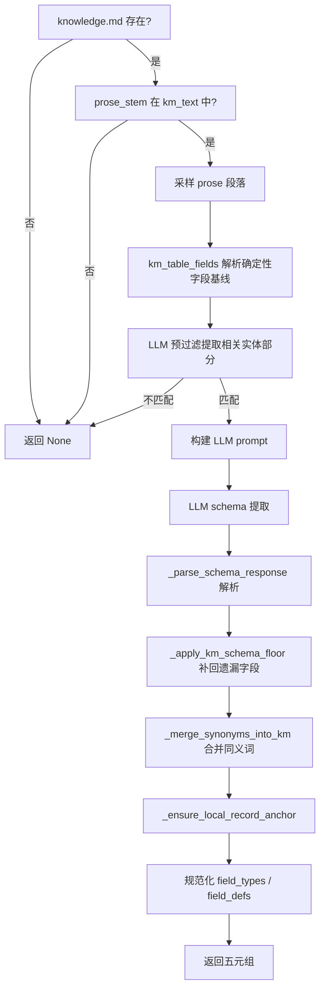

# Phase 0 - Schema Inference（模式推断）

## 1. 概述

### 1.1 在 ETL 管线中的位置

Schema Inference 是 Mamba Agent ETL 管线的**第零阶段**（Phase 0），在所有下游阶段（字段提取、压缩、合并、验证）之前执行。其作用是**确定目标数据集的字段结构**，为后续的 LLM 压缩和结构化提取提供明确的 schema 定义。

```
ETL 管线大致流程：
  Phase 0: Schema Inference ──→ Phase 1: Compression ──→ Phase 2: Merge ──→ Phase 3: Verify
               │                        │                       │
               │                        ▼                       │
               │              (按 schema 提取字段)              │
               │                                                  │
               └──────── schema_columns, anchor_keys, ──────────→┘
                         field_types, field_units, field_defs
```

### 1.2 何时触发

Schema Inference 有两种触发路径：

| 触发条件 | 调用函数 | 数据来源 |
|---------|---------|---------|
| `knowledge.md` **存在**且包含对应表名 | `parse_knowledge_schema()` | governance 文档 + prose 采样 |
| `knowledge.md` **不存在或无关** | `infer_schema_from_sample()` | 仅 prose 文本采样 |

### 1.3 核心输出

无论是哪条路径，最终输出都是同一个五元组：

```python
(schema_columns, anchor_keys, field_types, field_units, field_defs)
```

| 返回值 | 类型 | 说明 |
|-------|------|------|
| `schema_columns` | `list[str]` | 所有字段名（蛇形命名，小写+下划线） |
| `anchor_keys` | `list[str]` | 身份标识字段列表（`anchor_keys[0]` 是主键 PK） |
| `field_types` | `dict[str, str]` | 字段 → 类型映射（如 `"number"`, `"date"`, `"string"`, `"integer_scalar_id"`） |
| `field_units` | `dict[str, str]` | 字段 → 单位映射（如 `"亿元"`, `"%"`），仅对带显式单位的数值字段 |
| `field_defs` | `dict[str, str]` | 字段 → 语义定义映射（一句话描述） |

---

## 2. 核心函数：`infer_schema_from_sample()`

### 2.1 函数签名

```python
def infer_schema_from_sample(
    adapter: ModelAdapter,
    prose_text: str,
    question: str,
    table_name: str | None = None,
) -> tuple[list[str], list[str], dict[str, str], dict[str, str], dict[str, str]] | None:
```

**文件位置**：`_schema.py` 第 1211–1258 行

### 2.2 输入参数

| 参数 | 类型 | 说明 |
|------|------|------|
| `adapter` | `ModelAdapter` | LLM 调用适配器，负责与后端模型交互 |
| `prose_text` | `str` | 原始散文文本（完整的 .md/.txt 文件内容） |
| `question` | `str` | 任务问题（来自 `task.json`），为 LLM 提供上下文 |
| `table_name` | `str \| None` | 可选的表名，用于查找 schema KB 中的参考 schema |

### 2.3 返回值

返回五元组 `(columns, anchor_keys, field_types, field_units, field_defs)`，或 `None`（当采样文本过短时）。

### 2.4 核心逻辑步骤

```
1. 采样 document 段落
   └── sample_paragraphs_by_section(prose_text)
   └── 如果采样结果 < 50 字符 → 返回 None

2. 多轮推断（SCHEMA_SAMPLE_ROUNDS = 3 轮）
   └── 每轮调用 _infer_schema_single(adapter, sample, question, table_name)
   └── 收集每轮结果到 rounds 列表

3. 合并多轮结果
   └── _merge_multi_round_schemas(adapter, rounds)
   └── Union 所有字段 → LLM 裁决同义词 → 去重

4. 确保本地记录 ID 锚点
   └── _ensure_local_record_anchor(prose_text, columns, anchor_keys, field_types)

5. 规范化输出
   └── _complete_schema_field_types(columns, field_types)
   └── _complete_schema_field_defs(columns, field_defs)

6. 返回最终五元组
```

### 2.5 关键代码片段

```python
# 第 1224–1240 行：采样 + 多轮推断 + 合并
sample = sample_paragraphs_by_section(prose_text)
if not sample or len(sample) < 50:
    return None

rounds: list[...] = []
for _i in range(SCHEMA_SAMPLE_ROUNDS):  # 默认 3 轮
    result = _infer_schema_single(adapter, sample, question, table_name=table_name)
    if result:
        rounds.append(result)

if not rounds:
    return None

columns, anchor_keys, field_types, field_units, field_defs = _merge_multi_round_schemas(
    adapter, rounds
)

# 第 1242–1249 行：本地记录锚点 + 规范化
columns, anchor_keys = _ensure_local_record_anchor(prose_text, columns, anchor_keys, field_types)
field_types = _complete_schema_field_types(columns, field_types)
field_defs = _complete_schema_field_defs(columns, field_defs)
return columns, anchor_keys, field_types, field_units, field_defs
```

### 2.6 采样策略：`sample_paragraphs_by_section()`

该函数位于 `_compress.py` 第 159–216 行。其采样策略如下：

```
输入: 完整的散文文本 + token_limit (默认 8000 tokens)

1. 检测段落（section）边界
   └── detect_sections(text) — 按 Markdown 标题分割
   └── 如果 < 3 个 section，将整个文档视为一个 section

2. 对每个 section 提取段落（paragraphs）
   └── 按 \n\n 分割，过滤长度 > 50 字符的段落

3. 按比例分配采样预算
   └── build(scale=1.0) — 取全部段落
   └── 计算 token 数，如果 ≤ token_limit → 返回全文
   └── 否则按比例缩减 scale，重新采样（最多 8 次迭代）

4. 缩减策略：CENTERED systematic sampling
   └── 每个 section 内取 k = max(1, round(len(paras) * scale)) 个段落
   └── 索引算法：indices = {round((j + 0.5) * len(paras) / k - 0.5) for j in range(k)}
   └── 即取每个"桶"的中间位置，避免边界偏倚

5. 极端情况回退
   └── 如果每个 section 取一个段落仍超预算：
   └── 展平所有段落，按比例跨步采样
```

**为什么用 centered sampling？** 边界段落（intro/outro）往往是叙述性文字，包含的数据字段最少；中间段落携带最多结构化数据值。

---

## 3. 核心函数：`_infer_schema_single()`

### 3.1 函数签名

```python
def _infer_schema_single(
    adapter: ModelAdapter,
    sample: str,
    question: str,
    table_name: str | None = None,
) -> tuple[list[str], list[str], dict[str, str], dict[str, str], dict[str, str]] | None:
```

**文件位置**：`_schema.py` 第 1007–1092 行

### 3.2 核心逻辑

```
1. 构建 LLM prompt
   └── 包含：采样文本、任务问题、可选的 reference schema（来自 schema_kb.db）
   └── 要求 LLM 输出恰好 6 行：PK / ANCHORS / TYPES / UNITS / DEFS / columns

2. 调用 LLM
   └── adapter.complete(messages) → 返回 ModelResponse

3. 解析 LLM 响应
   └── _parse_schema_response(response.content) → 解析六行格式

4. 返回 parsed 五元组
   └── (columns, anchor_keys, explicit_types, field_units, raw_defs)
```

### 3.3 LLM Prompt 结构

Prompt 要求 LLM 输出格式严格固定：

```
Line 1: PK: <primary_key_field_name>
Line 2: ANCHORS: <comma-separated identity fields including PK>
Line 3: TYPES: <field=type, field=type, ...>
Line 4: UNITS: <field=unit, ...>
Line 5: DEFS: <field=definition; field=definition; ...>
Line 6: all field names as a comma-separated list
```

### 3.4 响应解析：`_parse_schema_response()`

该函数位于 `_schema.py` 第 171–239 行，按行前缀（不按位置）解析 LLM 输出：

```
输入: LLM 原始文本输出

1. 按行分割，去除空白和反引号

2. 识别前缀行：
   └── PK: → 提取主键字段名
   └── ANCHOR(S): → 按逗号分割提取锚点列表
   └── TYPE(S): → 调用 _parse_schema_types_line() 解析 field=type
   └── UNIT(S): → 调用 _parse_kv_line() 解析 field=unit
   └── DEF(S): → 调用 _parse_defs_line() 解析 field=definition

3. 识别列名行（第一个包含逗号且无等号的非前缀行）

4. 规范化：
   └── _canonicalize_casefold_names() 消除大小写重复
   └── 确保 PK 在 anchor_keys 中
   └── 确保 anchor_keys 中的字段都在 columns 中

5. 返回 (pk, anchor_keys, explicit_types, columns, field_units, field_defs)
```

---

## 4. 核心函数：`parse_knowledge_schema()`

### 4.1 函数签名

```python
def parse_knowledge_schema(
    task: PublicTask,
    prose_path: Path,
    adapter: ModelAdapter,
    prose_text: str,
) -> tuple[list[str], list[str], dict[str, str], dict[str, str], dict[str, str]] | None:
```

**文件位置**：`_schema.py` 第 593–859 行

### 4.2 输入参数

| 参数 | 类型 | 说明 |
|------|------|------|
| `task` | `PublicTask` | 任务对象，包含 `context_dir` 指向 `knowledge.md` 所在目录 |
| `prose_path` | `Path` | 散文文件路径，仅使用 `.stem`（不含扩展名的文件名） |
| `adapter` | `ModelAdapter` | LLM 适配器 |
| `prose_text` | `str` | 散文文本内容 |

### 4.3 核心逻辑步骤

```
1. 检查 knowledge.md 是否存在
   └── task.context_dir / "knowledge.md"
   └── 不存在 → 返回 None

2. 确定性门控（Deterministic gate）
   └── 检查 prose_stem 是否在 km_text 中出现（大小写不敏感）
   └── 不出现 → 返回 None（避免错误匹配其他表的 schema）

3. 抽取 prose 采样
   └── sample_paragraphs_by_section(prose_text)

4. 确定性字段基线（Deterministic field floor）
   └── km_table_fields(km_text, prose_stem)
   └── 从原始 governance 文本中解析表格字段

5. LLM 预过滤（Entity pre-filter）
   └── _extract_relevant_entity(adapter, km_text, prose_stem, prose_sample)
   └── 从多表 governance 文档中提取与当前 prose 文件匹配的实体部分
   └── 如果过滤结果不包含表名 → 视为无匹配，返回 None

6. 构建 LLM 提取 prompt
   └── 包含：governance 文本、prose 采样（在 km_fields 为空时提供）、
         可选的 KB reference（从 schema_kb.db 查找）
   └── 要求 LLM 输出同样的 6 行格式

7. 解析 LLM 响应
   └── _parse_schema_response(raw)

8. 应用 governance 字段地板
   └── _apply_km_schema_floor(columns, raw_defs, km_fields)
   └── 重新添加 governance 中列出但 LLM 遗漏的字段

9. 合并同义词到 governance 名称
   └── _merge_synonyms_into_km(adapter, columns, raw_defs, km_fields)
   └── 重新映射元数据（_remap_schema_metadata）
   └── 重新映射锚点键（_remap_anchor_keys）

10. 确保本地记录 ID 锚点
    └── _ensure_local_record_anchor(prose_text, columns, anchor_keys, explicit_types)

11. 规范化输出
    └── _complete_schema_field_types / _complete_schema_field_defs
```

### 4.4 流程图



### 4.5 重试机制

当 LLM 返回 `NONE` 但 prose_stem 确实出现在 governance 文档中时，系统会执行一次重试（第 786–811 行）：

```python
# 关键代码：第 783–811 行
if not raw or raw.strip().strip("`").upper() == "NONE":
    if prose_stem.lower() in km_text.lower():
        hint = ModelMessage(
            role="user",
            content=f'The governance document DOES contain a section for "{prose_stem}"...',
        )
        response = adapter.complete([*messages, ModelMessage(role="assistant", content="NONE"), hint])
```

---

## 5. 核心函数：`merge_prose_schema_into_governance()`

### 5.1 函数签名

```python
def merge_prose_schema_into_governance(
    adapter: ModelAdapter,
    prose_text: str,
    gov_columns: list[str],
    gov_defs: dict[str, str],
    gov_types: dict[str, str],
    question: str,
    table_name: str | None = None,
) -> tuple[list[str], dict[str, str], dict[str, str]]:
```

**文件位置**：`_schema.py` 第 274–370 行

### 5.2 用途

当 governance schema 已存在，但需要在 prose 中发现**额外字段**时调用。它独立地从 prose 推断 schema，然后用 LLM 裁决哪些 prose 字段是 governance 字段的同义词、哪些是真正的额外字段。

### 5.3 核心逻辑步骤

```
1. 独立从 prose 推断 schema
   └── _infer_schema_single(adapter, sample_paragraphs_by_section(prose_text), ...)
   └── 不传入 governance 上下文 → 无偏发现所有字段

2. 提取 novel 字段
   └── 规范化：strip_key() 去除下划线和连字符后比较
   └── 排除已存在于 governance 中的字段
   └── 排除 record_id 类字段

3. 如果没有 novel 字段 → 直接返回 ([], {}, {})

4. LLM 裁决同义词
   └── 构建 prompt：列出 governance 规范字段 + prose 额外字段
   └── 要求 LLM 判断每个额外字段是 SYNONYM 还是 DISTINCT
   └── 特别注意：子总额和总额即使名称相似也是 DISTINCT
   └── 包含 FUND_FIELD_DISAMBIGUATION_PROMPT

5. 解析 LLM 响应
   └── 提取标记为 DISTINCT 的字段

6. 返回 extra_columns, extra_types, extra_defs
```

### 5.4 返回值

```python
# 示例返回值
(
    ["transfer_shares", "event_date"],  # extra_columns
    {"transfer_shares": "number", "event_date": "date"},  # extra_types
    {"transfer_shares": "转让股份数量", "event_date": "事件发生日期"},  # extra_defs
)
```

---

## 6. 辅助函数

### 6.1 `_has_local_record_ids()`

```python
def _has_local_record_ids(prose_text: str) -> bool:
```

**位置**：`_schema.py` 第 31–48 行

**用途**：检测文档是否使用重复的文档本地记录标识符（如 "档案 29"、"Record 29"、"rec0Si5cQ4rJRVzd6"、"TR391"）。

**检测策略**：

| 检测类型 | 正则 | 阈值 |
|---------|------|------|
| 关键词前缀数字 ID | `LOCAL_RECORD_ID_RE`（如 "档案 29"） | ≥ 3 个不同 ID |
| Airtable 风格 ID | `AIRTABLE_ID_RE`（如 `rec0Si5cQ4rJRVzd6`） | ≥ 3 个不同 ID |
| 代码风格 ID | `CODE_ID_RE`（如 TR391, TR483） | 同一个前缀下 ≥ 3 个不同数字 |

```python
# 关键代码：第 37–48 行
matches = LOCAL_RECORD_ID_RE.findall(prose_text)
if len(set(matches)) >= 3:
    return True
if len(set(AIRTABLE_ID_RE.findall(prose_text))) >= 3:
    return True
codes_by_prefix: dict[str, set[str]] = {}
for prefix, number in CODE_ID_RE.findall(prose_text):
    codes_by_prefix.setdefault(prefix, set()).add(number)
return any(len(numbers) >= 3 for numbers in codes_by_prefix.values())
```

### 6.2 `_ensure_local_record_anchor()`

```python
def _ensure_local_record_anchor(
    prose_text: str,
    columns: list[str],
    anchor_keys: list[str],
    explicit_types: dict[str, str] | None = None,
) -> tuple[list[str], list[str]]:
```

**位置**：`_schema.py` 第 51–87 行

**用途**：当 prose 按文档本地记录 ID 分节时，确保 `record_id` 出现在 columns 和 anchor_keys 的第一个位置。

**决策逻辑**：

```
1. 如果 columns 或 anchor_keys 已包含 RECORD_ID_FIELDS 中任一字段
   → 将该字段提升到第一位置

2. 否则，如果 explicit_types 中有字段类型包含 "local_record_id"
   → 将该字段提升到第一位置

3. 否则，如果 prose 中不使用本地记录 ID
   → 原样返回

4. 否则，添加 "record_id" 到 columns 和 anchor_keys 的第一个位置
```

```python
# 关键代码：第 81–87 行
if not _has_local_record_ids(prose_text):
    return columns, anchor_keys

columns = ["record_id", *columns]
anchor_keys = ["record_id", *anchor_keys]
```

### 6.3 `km_table_fields()`

```python
def km_table_fields(km_text: str, prose_stem: str) -> dict[str, str]:
```

**位置**：`knowledge.py` 第 69–92 行

**用途**：从 `knowledge.md` 中确定性解析 governance 字段表，不依赖 LLM。

**解析策略**：

```
1. 标题级匹配（Heading-level matching）
   └── 查找包含 prose_stem 的 Markdown 标题行 (##/###/####)
   └── 从该标题到下一个同/更高级标题之间的区域
   └── 在该区域内解析 Markdown 表格

2. 行级回退（Row-level fallback）
   └── 如果标题级匹配未找到字段
   └── 查找表格行中第一列匹配 prose_stem 的行
   └── 提取第二列（字段名）和第三列（定义）
```

**Markdown 表格解析**（`_km_section_table_fields()`，第 10–37 行）：

```
1. 找到表格分隔行 (|---|---|)
2. 找到包含 "column"/"field"/"字段"/"列" 的表头列 → 确定字段名列索引
3. 对后续行，如果第一列匹配 KM_FIELD_CELL 模式（字母/数字/中文/括号/百分号/连字符 1-40 字符）
4. 提取字段名和下一列的定义
```

```python
# 关键代码：knowledge.py 第 69–92 行
def km_table_fields(km_text: str, prose_stem: str) -> dict[str, str]:
    lines = km_text.splitlines()
    # 先尝试标题级匹配
    for start, level in starts:
        end = ...  # 下一个同/更高级标题
        fields = _km_section_table_fields(lines, start, end)
        if fields:
            return fields
    # 回退到行级匹配
    return _km_table_rows_by_stem(lines, prose_stem)
```

### 6.4 `_merge_synonyms_into_km()`

```python
def _merge_synonyms_into_km(
    adapter: ModelAdapter,
    columns: list[str],
    raw_defs: dict[str, str],
    km_fields: dict[str, str],
) -> list[tuple[str, str]]:
```

**位置**：`_schema.py` 第 373–464 行

**用途**：将 LLM 推断的字段中与 governance 字段同义词的字段合并，保留 canonical 名称。

### 6.5 `_apply_km_schema_floor()`

```python
def _apply_km_schema_floor(
    columns: list[str],
    raw_defs: dict[str, str],
    km_fields: dict[str, str],
) -> list[str]:
```

**位置**：`_schema.py` 第 508–531 行

**用途**：重新添加 governance 文档中列出但 LLM 遗漏的字段。governance 文档的字段表是权威的。

### 6.6 `_extract_relevant_entity()`

```python
def _extract_relevant_entity(
    adapter: ModelAdapter,
    km_text: str,
    prose_stem: str,
    prose_sample: str,
) -> str | None:
```

**位置**：`_schema.py` 第 534–590 行

**用途**：从多表 governance 文档中预过滤出与当前 prose 文件匹配的实体部分，防止跨表列污染。

### 6.7 `_canonicalize_casefold_names()`

```python
def _canonicalize_casefold_names(
    names: list[str],
    preferred: dict[str, str] | None = None,
) -> tuple[list[str], list[tuple[str, str]]]:
```

**位置**：`_schema.py` 第 143–168 行

**用途**：消除仅大小写不同的重复字段名。当提供 `preferred` 字典时，使用其值作为规范拼写。

### 6.8 `_complete_schema_field_types()` / `_complete_schema_field_defs()`

```python
def _complete_schema_field_types(
    columns: list[str],
    explicit_types: dict[str, str] | None = None,
) -> dict[str, str]:

def _complete_schema_field_defs(
    columns: list[str],
    field_defs: dict[str, str] | None = None,
) -> dict[str, str]:
```

**位置**：`_schema.py` 第 258–271 行 / 第 242–255 行

**用途**：将 LLM 提供的字段类型/定义映射到 schema 列的确切拼写（大小写规范化）。

### 6.9 `infer_field_units_from_prose()`

```python
def infer_field_units_from_prose(
    adapter: ModelAdapter,
    prose_sample: str,
    columns: list[str],
    field_defs: dict[str, str],
    existing_units: dict[str, str],
) -> dict[str, str]:
```

**位置**：`_schema.py` 第 862–952 行

**用途**：通过检查 prose 中的数值后缀来识别已有字段的单位。仅对已在 `columns` 中的字段输出单位，绝不发明新字段。已有单位（`existing_units`）不会被覆盖。

### 6.10 Schema Knowledge Base（`_schema_kb.py`）

```python
@dataclass(frozen=True, slots=True)
class KnownSchema:
    table_name: str
    columns: list[str]
    dtypes: dict[str, str]
    sample_rows: list[dict[str, object]]

def lookup(table_key: str) -> KnownSchema | None:
    # 从 schema_kb.db 中查找已知表名（大小写不敏感）
    # 返回表名、列名、数据类型、最多 5 行样本数据
```

**位置**：`_schema_kb.py` 第 1–68 行

**用途**：提供已知表的参考 schema，帮助 LLM 更准确地推断字段名和值格式。数据来自 SQLite 文件 `schema_kb.db`。

---

## 7. `_merge_multi_round_schemas()`

### 7.1 函数签名

```python
def _merge_multi_round_schemas(
    adapter: ModelAdapter,
    rounds: list[tuple[list[str], list[str], dict[str, str], dict[str, str], dict[str, str]]],
) -> tuple[list[str], list[str], dict[str, str], dict[str, str], dict[str, str]]:
```

**位置**：`_schema.py` 第 1095–1208 行

### 7.2 核心逻辑

```
1. 如果只有 1 轮结果 → 直接返回

2. Union 所有字段
   └── 按大小写去重，排除 RECORD_ID_FIELDS
   └── 合并 anchor_keys、types、units、defs

3. 如果没有新字段 → 直接返回

4. LLM 裁决同义词
   └── 列出所有 union 后的字段及其定义
   └── 要求 LLM 分组：canonical_name = synonym1, synonym2, ...
   └── 无同义词的字段标记为 unique

5. 应用同义词映射
   └── 重新映射 anchor_keys、types、units、defs
```

---

## 8. 数据流全貌

### 8.1 输入

```
原始散文文本（.md / .txt / .pdf 提取内容）
         │
         ▼
sample_paragraphs_by_section()
         │
         ▼
    采样文本（≤ 8000 tokens）
         │
         ├──→ infer_schema_from_sample()  ← 无 knowledge.md
         │
         └──→ parse_knowledge_schema()    ← 有 knowledge.md
```

### 8.2 输出与下游

```
(schema_columns, anchor_keys, field_types, field_units, field_defs)
         │
         ├── Compression 阶段
         │   └── 按 schema 字段提取值
         │   └── 按 field_types 做类型强制（scalar validation）
         │   └── 按 field_units 做单位转换（可选）
         │
         ├── Merge 阶段
         │   └── anchor_keys 用于跨 section 记录合并
         │   └── 按 PK 做实体匹配
         │
         └── Verify 阶段
             └── 验证提取值的类型合规性
             └── 验证必填字段完整性
```

### 8.3 常量定义

| 常量 | 值 | 用途 |
|------|-----|------|
| `SCHEMA_SAMPLE_ROUNDS` | 3 | 多轮推断的轮次 |
| `SCHEMA_SAMPLE_TOKEN_BUDGET` | 8000 | 采样 token 预算 |
| `RECORD_ID_FIELDS` | `{"record_id", "archive_id", "file_id", "case_id", "entry_id", "local_id", "unit_id"}` | 本地记录 ID 字段名集合 |

---

## 9. 复现代码行为指南

### 9.1 最小复现示例

```python
from pathlib import Path
from agents.llm import ModelAdapter
from agents.etl._schema import infer_schema_from_sample

# 准备输入
adapter = ModelAdapter(...)  # 初始化 LLM 适配器
prose_text = Path("data/document.md").read_text(encoding="utf-8")
question = "Extract the financial indicators and their values."

# 推断 schema
result = infer_schema_from_sample(adapter, prose_text, question)
if result:
    columns, anchor_keys, field_types, field_units, field_defs = result
    print(f"Fields: {columns}")
    print(f"PK: {anchor_keys[0]}")
    print(f"Types: {field_types}")
else:
    print("Schema inference failed: sample too short or LLM error")
```

### 9.2 带 knowledge.md 的复现

```python
from pathlib import Path
from agents.llm import ModelAdapter
from agents.benchmark.schema import PublicTask
from agents.etl._schema import parse_knowledge_schema

# 准备输入
task = PublicTask(context_dir=Path("data/context"))
prose_path = Path("data/context/economic_indicators.md")
adapter = ModelAdapter(...)
prose_text = prose_path.read_text(encoding="utf-8")

# 解析 governance schema
result = parse_knowledge_schema(task, prose_path, adapter, prose_text)
if result:
    columns, anchor_keys, field_types, field_units, field_defs = result
```

### 9.3 合并 prose 字段到 governance

```python
from agents.etl._schema import merge_prose_schema_into_governance

extra_cols, extra_types, extra_defs = merge_prose_schema_into_governance(
    adapter=adapter,
    prose_text=prose_text,
    gov_columns=["gdp", "population", "year"],
    gov_defs={"gdp": "国内生产总值", "population": "人口数量", "year": "年份"},
    gov_types={"gdp": "number", "population": "number", "year": "date"},
    question="Extract economic indicators",
)
```

### 9.4 关键正则表达式

| 模式 | 用途 |
|------|------|
| `LOCAL_RECORD_ID_RE` | 匹配 "档案 29"、"Record 29" 等 |
| `AIRTABLE_ID_RE` | 匹配 `rec0Si5cQ4rJRVzd6` 等 Airtable ID |
| `CODE_ID_RE` | 匹配 `TR391`、`SC170` 等代码风格 ID |
| `KM_HEADING` | 匹配 Markdown 标题 `## xxx` |
| `KM_TABLE_SEPARATOR` | 匹配表格分隔行 `|---|---|` |
| `KM_FIELD_CELL` | 匹配字段名单元格（字母/数字/中文/符号 1-40 字符） |
| `SCHEMA_RESPONSE_PREFIX` | 匹配 `PK:`、`ANCHORS:`、`TYPES:`、`UNITS:`、`DEFS:` 前缀 |

---

## 10. 错误处理与边界情况

### 10.1 采样过短

```python
# _schema.py 第 1225–1226 行
if not sample or len(sample) < 50:
    return None
```

### 10.2 LLM 调用失败

每处 LLM 调用都有 `try/except` 包裹，失败时：
- `_infer_schema_single()` → 返回 `None`（该轮结果被丢弃）
- `parse_knowledge_schema()` → 返回 `None`（走纯 prose 推断路径）
- `merge_prose_schema_into_governance()` → 返回 `([], {}, {})`（无额外字段）

### 10.3 governance 文档不匹配

```python
# 第 621–626 行：确定性门控
if prose_stem.lower() not in km_text.lower():
    return None  # 跳过 knowledge 路径
```

### 10.4 LLM 返回 NONE 但表名确实存在

触发器试机制（第 783–811 行），向 LLM 明确提示表名出现在 governance 文档中。

---

## 11. 类型映射

LLM 在 `TYPES:` 行中使用的类型标签：

| 类型标签 | 说明 | 示例值 |
|---------|------|-------|
| `integer_scalar_id` | 整数标量 ID | `1`, `29`, `353` |
| `scalar_id` | 字母数字标量 ID | `rec0Si5cQ4rJRVzd6`, `TR391` |
| `integer_scalar local_record_id` | 整数本地记录 ID | 纯数字的记录标识符 |
| `scalar_id local_record_id` | 字母数字本地记录 ID | Airtable/代码风格记录标识符 |
| `number` | 数值 | `2478.76`, `15.3` |
| `integer_count` | 整数计数 | `42`, `1000` |
| `integer_rank` | 整数排名 | `1`, `2`, `3` |
| `string` | 字符串（含 "xx/yy" 格式排名） | `"43/166"`, `"Equity Fund"` |
| `date` | 日期 | `"2023-12-31"`, `"2023"` |
| `time` | 时间 | `"14:30:00"` |
| `category` | 分类 | `"ETF"`, `"LOF"`, `"股票型"` |
| `boolean` | 布尔 | `"Yes"`, `"No"`, `"是"`, `"否"` |
| `url` | URL | `"https://example.com"` |